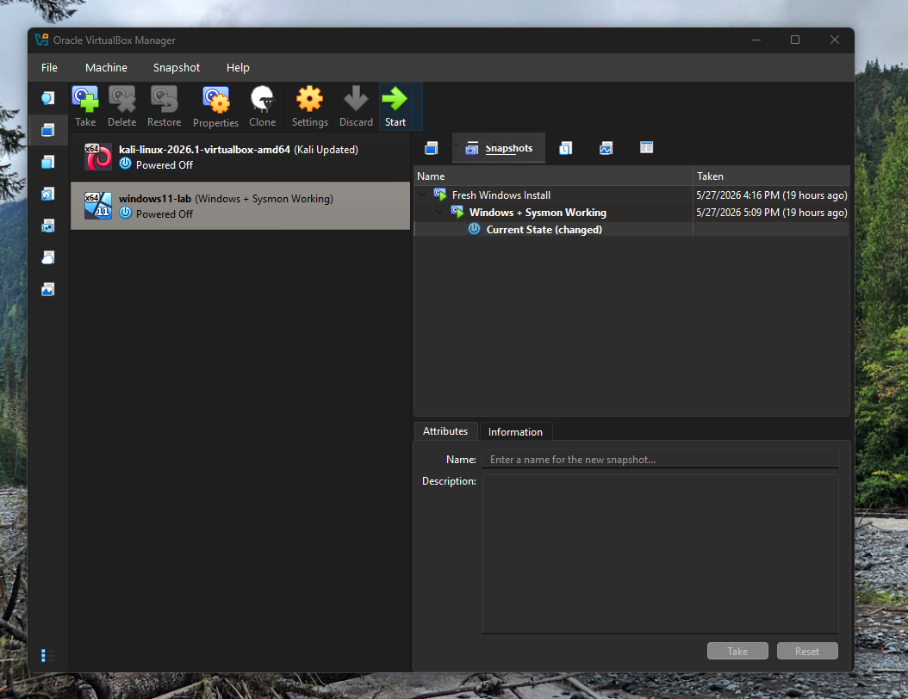
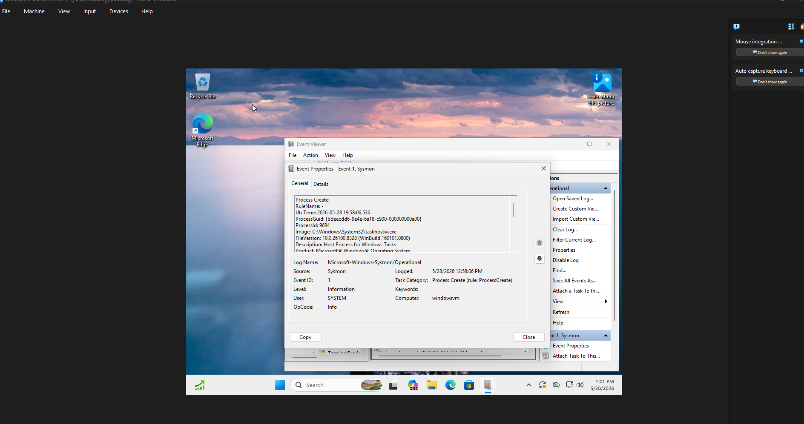
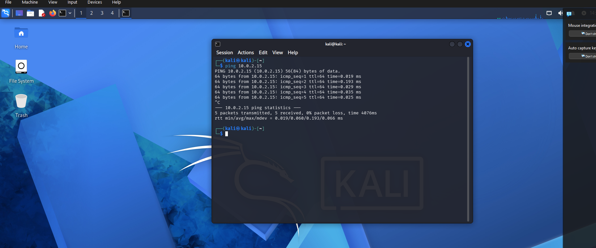
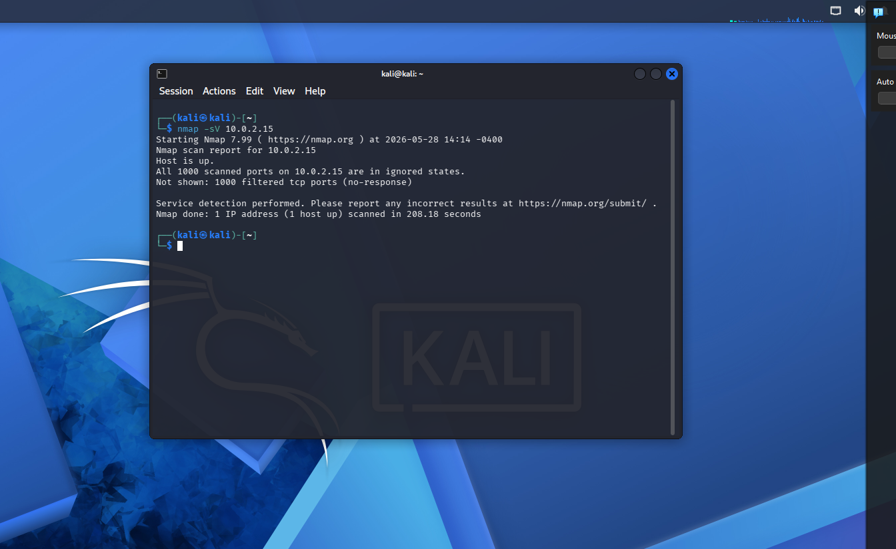
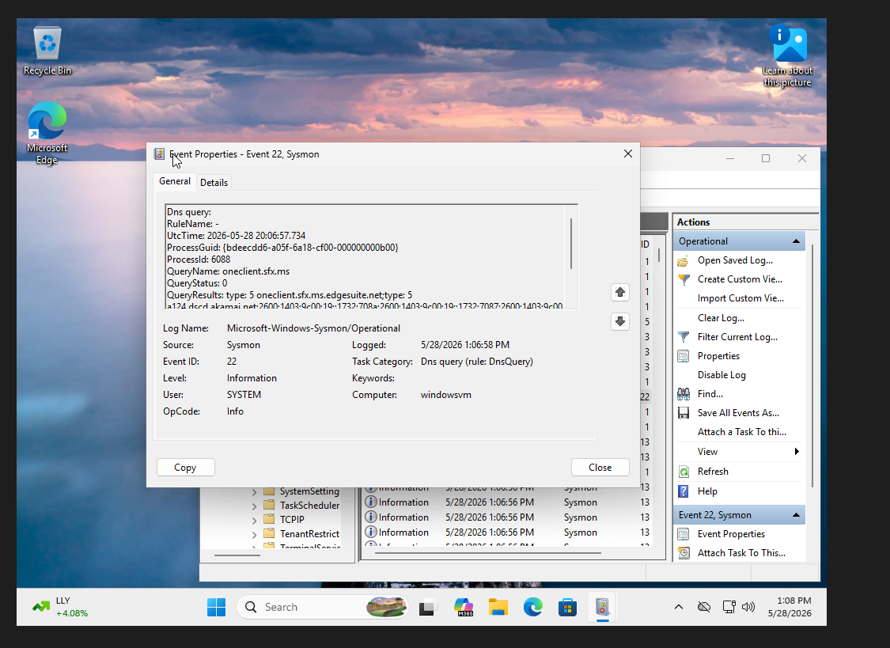

# Day 1: Setting Up the Lab

I began by installing VirtualBox, along with the preconfigured VM version of Kali Linux, and a Windows 11 ISO. Windows 11 was chosen to better simulate a typical corporate workstation. It initially gave me trouble by trying to force me to create a microsoft account, but I was able to use an OOBE bypass command in the terminal, which let me create an offline account. I then updated/upgraded Kali and installed Sysmon on Windows. Finally, I pinged the Windows VM via Kali to ensure the two computers were communicating. 

After this, I initiated my first Nmap scan of the "target" computer. Nmap reported all ports filtered because Windows Firewall blocked responses. Likewise, the incoming requests from Kali were logged by Sysmon. 

